# Concentration-QTc modeling example

## INTRODUCTION

This is a basic tutorial illustrating the use of the cqtc package to
conduct exposure-response analyses for the QT interval of the
electrocardiogram.

### Background

Investigation of the pro-arrhythmic potential of new drugs is an
explicit regulatory concern, and the International Council for
Harmonisation (ICH) has issued a dedicated guideline, [ICH
E14](https://www.ema.europa.eu/en/documents/scientific-guideline/ich-e-14-clinical-evaluation-qtqts-interval-prolongation-and-proarrhythmic-potential-non-antiarrhythmic-drugs-step-5_en.pdf),
that summarizes the expectations to such investigations.

Typically, a dedicated trial to investigate the effect of the drug on
the cardiac repolarization (‘thorough QT/QTc study’) would satisfy these
expectations. However, alignment between industry partners and
regulatory bodies has been achieved, that a well-designed and conducted
QTc assessment based on concentration-QTc modeling (‘c-QTc analysis’)
can be in many cases sufficient to exclude clinically relevant QTc
effects. This has been summarized in a scientific white paper by Garnett
et al., 2017 (<https://doi.org/10.1007/s10928-017-9558-5>).

The central paradigm of the modeling approach established in this white
paper is to use a pre-specified linear mixed-effects model for the
change in the QTc interval relative to the pre-treatment baseline value
($`\Delta QTc`$) with fixed effects of intercept ($`\theta _0`$), slope
($`\theta _2`$), influence of baseline QTc on intercept ($`\theta _4`$),
treatment ($`\theta _1`$, i.e., active or placebo) and nominal time from
first dose ($`\theta _3`$). Random effects are included on the intercept
($`\eta _{0,1}`$), slope ($`\eta _{2,i}`$):

``` math
\Delta QTc_{ijk} = (\theta _0 + \eta _{0,i}) + \theta _1 TRT_j(\theta _2 + \eta _{2,i})C_{ijk} + \theta _3 TIME_j + \theta _4 (QTc_{ij=0} - \overline{QTc_0})
```

Indices refer to subject ($`i`$), treatment ($`j`$), and time ($`k`$).

While this pre-specified model is recommended, alternative approaches
can be used if the data structure or the relationship between drug
concentration and $`\Delta QTc`$ deviate from the assumptions. For this
reason, code for the actual linear mixed-effects modeling is not part of
this package as it may be subject to specific considerations.

The focus of the cqtc package is to facilitate and standardize the
generation of the c-QTc analysis data set, to support consistency checks
and exploratory analyses, and to check the model-independent assumptions
that underlie the linear mixed-effects modeling approach.

### Outline

This example is based on *Parkinson, J., Dota, C. & Rekić, D. Practical
guide to concentration-QTc modeling: a hands-on tutorial. J
Pharmacokinet Pharmacodyn 52, 43 (2025)*.
<https://doi.org/10.1007/s10928-025-09981-8>

The dofetilide and verapamil data sets used in the above publication are
provided as sample data sets as part of this package. The below example
makes use of the dofetilide data.

The first part of this tutorial demonstrates how an analysis-ready c-QTc
data set for dofetilide is constructed from these data. The second part
illustrates how the basic modeling assumptions are checked using
exploratory analyses, and the third part focuses on the actual linear
mixed-effects modeling.

The tutorial relies on the following R packages:

``` r
library(dplyr)
library(ggplot2)
library(knitr)
library(lme4)
library(lmerTest)
library(lsmeans)
library(cqtc)
```

## DATA PREPROCESSING

The structure of the dofetilide data set is:

``` r
head(dofetilide_cqtc, 5)
#>   ID ACTIVE NTIME CONC       QT     QTCF      DQTCF       RR HR
#> 1  1  FALSE  -0.5    0 371.0000 391.5099  0.0000000 851.0000 71
#> 2  1  FALSE   0.5    0 381.3333 385.5113 -5.9985922 968.0000 62
#> 3  1  FALSE   1.0    0 368.6667 391.3640 -0.1459669 836.0000 72
#> 4  1  FALSE   1.5    0 368.0000 389.4623 -2.0476373 844.0000 71
#> 5  1  FALSE   2.0    0 377.3333 394.0007  2.4907356 878.6667 68
```

Dedicated thorough QT studies will usually provide data from cross-over
treatment with both active and placebo treatments in the same subjects.
This allows modeling of the intra-individual difference to placebo
treatment, $`\Delta
\Delta QTcF`$, rather than $`\Delta QTcF`$ only. The dofetilide data set
includes concentration-QTc data for active and placebo treatments from a
parallel group design. The analysis endpoint is $`\Delta \Delta QTcF`$,
where the placebo group mean $`\Delta QTc`$ for each time points is
subtracted from the individual $`\Delta
QTc`$ of the active group.

To make the dofetilide data accessible for modeling using the
aforementioned pre-specified model, is extended adding the following
columns:

- individual baseline QTcF (BL_QTCF):

``` math
BL\_QTCF = QTcF_{i,0}
```

- the population mean for the baseline QTcF by treatment group
  (PM_BL_QTCF):

``` math
PM\_BL\_QTF = \overline {QTc_0}
```

- the difference between the individual baseline QTcF and the respective
  population mean baseline QTcF:

``` math
DPM\_BL\_QTCF = QTc_{i,j=0} - \overline {QTc_0}
```

- the difference between DQTCF and the group mean DQTCF of the control
  population by time point (DDQTCF):

``` math
DDQTCF = \Delta \Delta QTcF_{i,t} = \Delta QTcF_{i,t} - \overline{\Delta QTcF_{control,t}}
```

In addition, the numeric nominal time field (NTIME) is changed to a
factor variable:

``` r
dof <- dofetilide_cqtc %>%
  cqtc_add_baseline("QTCF", baseline_filter = "NTIME == -0.5") |> 
  add_bl_popmean("BL_QTCF") |> 
  mutate(DPM_BL_QTCF = BL_QTCF - PM_BL_QTCF) |> 
  derive_group_delta("DQTCF") |> 
  mutate(NTIME = as.factor(NTIME)) |> 
  cqtc()
```

The last line in the above code pipeline converts the input data to a
cqtc object. This object is essentially only a wrapper around an
ordinary R data frame. However, during the conversion to a cqtc object,
some consistency checks are automatically conducted and missing fields
added, where possible. In addition printing a cqtc object will
automatically show only a summary of the data set:

``` r
dof
#> ----- c-QTc data set summary -----
#> Data from 44 subjects
#> 
#> QTcF observations per time point:
#>   NTIME   CONTROL   ACTIVE   NA   
#>   -0.5    22        22       NA   
#>   0.5     22        22       NA   
#>   1       22        22       NA   
#>   1.5     22        22       NA   
#>   2       22        22       NA   
#>   2.5     22        22       NA   
#>   3       22        22       NA   
#>   3.5     22        22       NA   
#>   4       22        22       NA   
#>   5       22        22       NA    
#>   (7 more rows)
#> 
#> Columns:
#>   ID, ACTIVE, NTIME, CONC, BL, BL_QTCF, PM_BL_QTCF, DPM_BL_QTCF, QT, QTCF,
#>   DQTCF, RR, HR, DDQTCF 
#> 
#> Data (selected columns):
#>   ID   ACTIVE   NTIME   CONC   QT      QTCF    DQTCF   RR      HR   
#>   1    FALSE    -0.5    0      371     391.5   0       851     71   
#>   1    FALSE    0.5     0      381.3   385.5   -6      968     62   
#>   1    FALSE    1       0      368.7   391.4   -0.1    836     72   
#>   1    FALSE    1.5     0      368     389.5   -2      844     71   
#>   1    FALSE    2       0      377.3   394     2.5     878.7   68   
#>   1    FALSE    2.5     0      364     390.2   -1.3    811.7   74   
#>   1    FALSE    3       0      355     384.4   -7.1    788     76   
#>   1    FALSE    3.5     0      360.3   384.7   -6.8    823.3   73   
#>   1    FALSE    4       0      355.3   386.2   -5.3    779     77   
#>   1    FALSE    5       0      361     391.5   0       784     77    
#> 694 more rows
#> 
#> Hash: 395095bd5d173cf31a4b94cb4ccbaefb
```

The underlying data frame can be printed using:

``` r
as.data.frame(dof) |> 
  head()
#>   ID ACTIVE NTIME CONC    BL  BL_QTCF PM_BL_QTCF DPM_BL_QTCF       QT     QTCF
#> 1  1  FALSE  -0.5    0  TRUE 391.5099   395.7591   -4.249215 371.0000 391.5099
#> 2  1  FALSE   0.5    0 FALSE 391.5099   395.7591   -4.249215 381.3333 385.5113
#> 3  1  FALSE     1    0 FALSE 391.5099   395.7591   -4.249215 368.6667 391.3640
#> 4  1  FALSE   1.5    0 FALSE 391.5099   395.7591   -4.249215 368.0000 389.4623
#> 5  1  FALSE     2    0 FALSE 391.5099   395.7591   -4.249215 377.3333 394.0007
#> 6  1  FALSE   2.5    0 FALSE 391.5099   395.7591   -4.249215 364.0000 390.2416
#>        DQTCF       RR HR   DDQTCF
#> 1  0.0000000 851.0000 71 0.000000
#> 2 -5.9985922 968.0000 62 2.279150
#> 3 -0.1459669 836.0000 72 5.279840
#> 4 -2.0476373 844.0000 71 3.367856
#> 5  2.4907356 878.6667 68 4.774198
#> 6 -1.2683179 811.6667 74 2.797502
```

## EXPLORATORY DATA ANALYSIS

### Drug effect on heart rate

``` r
rr_plot(dof, "QT", group = "ACTIVE")
```

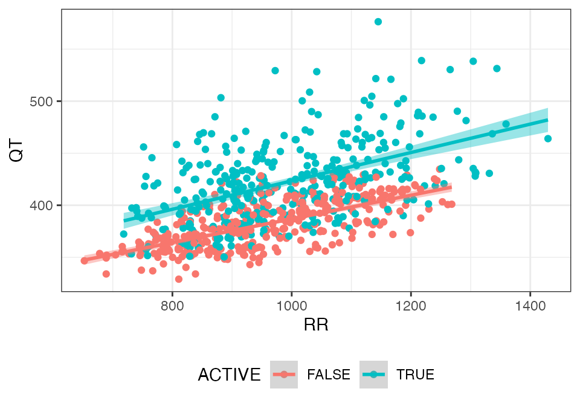

``` r
rr_plot(dof, "QTCF", group = "ACTIVE")
```

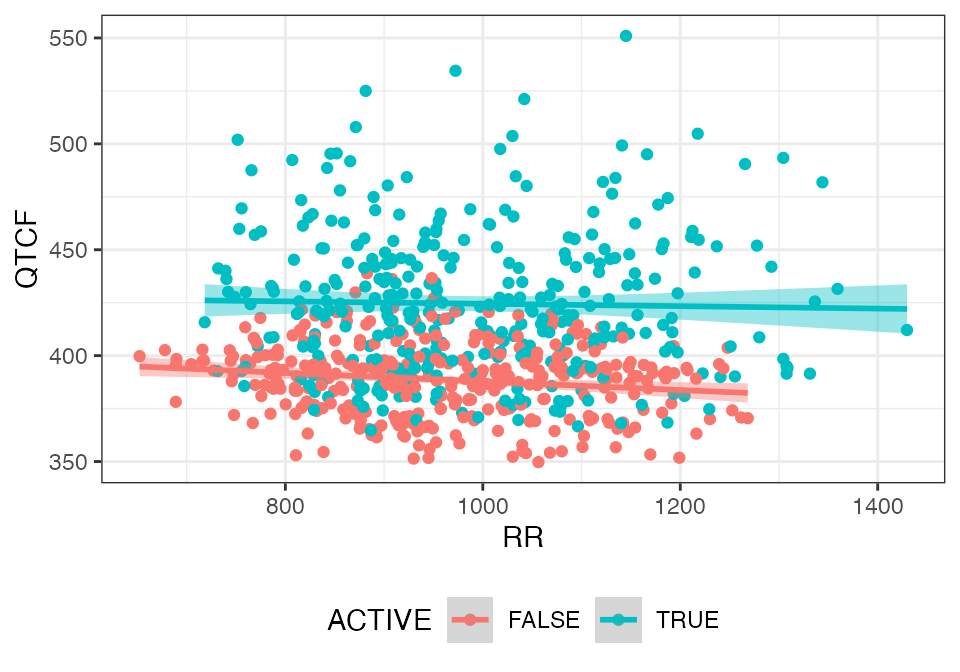

### Assessment of hysteresis

``` r
cqtc_time_course_plot(dof, "DQTCF")
```

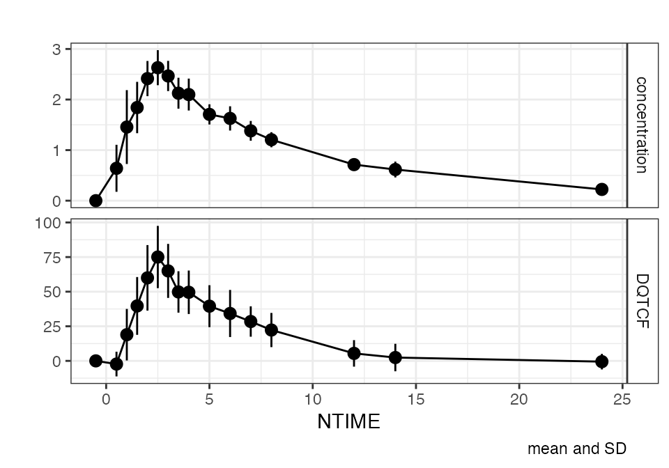

``` r
cqtc_hysteresis_plot(dof, "DDQTCF")
```

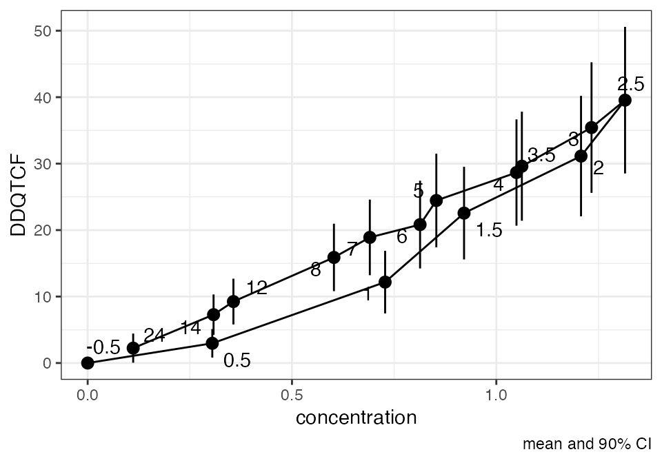

### Linear concentration-QTc relationship

``` r
cqtc_ntile_plot(dof, lm = TRUE, loess = TRUE)
```

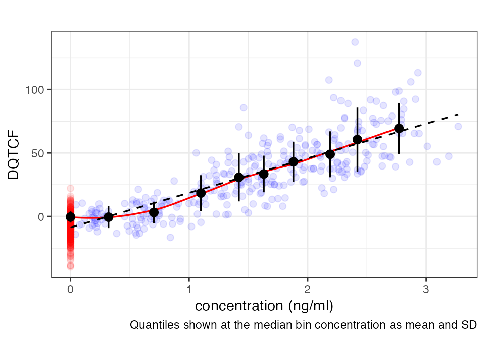

## LINEAR MIXED EFFECTS MODELING

### Modeling

``` r
mod <- lmerTest::lmer(
  DQTCF ~ NTIME + ACTIVE + DPM_BL_QTCF + CONC + (CONC||ID),
  data = dof)

# parameter estimates
cqtc_model_table(mod) %>% 
  kable(caption = "Model parameters")
#> Warning in cifun(p, parm = "beta_", method = conf.method, level = conf.level, :
#> ddf.method ignored when conf.method != "Wald"
```

| effect | term | estimate | std.error | statistic | df | p.value | conf.low | conf.high |
|:---|:---|---:|---:|---:|---:|---:|---:|---:|
| fixed | (Intercept) | 0.431 | 1.888 | 0.228 | 181.572 | 0.820 | -2.690 | 3.552 |
| fixed | NTIME0.5 | -13.873 | 1.998 | -6.944 | 628.196 | 0.000 | -17.164 | -10.582 |
| fixed | NTIME1 | -13.425 | 2.043 | -6.571 | 631.669 | 0.000 | -16.790 | -10.059 |
| fixed | NTIME1.5 | -7.524 | 2.085 | -3.609 | 629.253 | 0.000 | -10.959 | -4.090 |
| fixed | NTIME2 | -3.037 | 2.169 | -1.400 | 627.494 | 0.162 | -6.610 | 0.536 |
| fixed | NTIME2.5 | 0.471 | 2.206 | 0.214 | 627.493 | 0.831 | -3.162 | 4.105 |
| fixed | NTIME3 | -3.158 | 2.177 | -1.451 | 627.389 | 0.147 | -6.745 | 0.428 |
| fixed | NTIME3.5 | -7.892 | 2.121 | -3.720 | 626.853 | 0.000 | -11.386 | -4.398 |
| fixed | NTIME4 | -6.856 | 2.117 | -3.239 | 626.652 | 0.001 | -10.342 | -3.369 |
| fixed | NTIME5 | -7.558 | 2.063 | -3.664 | 626.404 | 0.000 | -10.957 | -4.160 |
| fixed | NTIME6 | -8.118 | 2.053 | -3.954 | 626.260 | 0.000 | -11.500 | -4.736 |
| fixed | NTIME7 | -8.663 | 2.025 | -4.277 | 626.059 | 0.000 | -11.999 | -5.326 |
| fixed | NTIME8 | -9.530 | 2.009 | -4.744 | 626.050 | 0.000 | -12.839 | -6.221 |
| fixed | NTIME12 | -13.297 | 1.972 | -6.743 | 625.682 | 0.000 | -16.546 | -10.049 |
| fixed | NTIME14 | -13.074 | 1.967 | -6.646 | 625.796 | 0.000 | -16.314 | -9.833 |
| fixed | NTIME24 | -5.782 | 1.954 | -2.959 | 625.318 | 0.003 | -9.000 | -2.563 |
| fixed | ACTIVETRUE | -0.861 | 2.050 | -0.420 | 69.016 | 0.676 | -4.279 | 2.557 |
| fixed | DPM_BL_QTCF | -0.171 | 0.052 | -3.278 | 41.760 | 0.002 | -0.258 | -0.083 |
| fixed | CONC | 26.715 | 1.580 | 16.905 | 29.313 | 0.000 | 24.031 | 29.399 |

Model parameters

``` r

# Model plot
cqtc_model_plot(dof, mod, loess = T, refline = c(0, 10, 20))
```

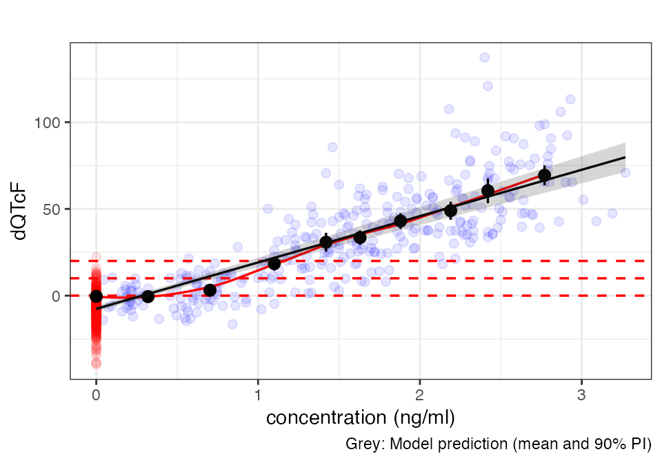

### Model diagnostics

``` r
invisible(capture.output(
  cqtc_gof_plot(mod)
))
```

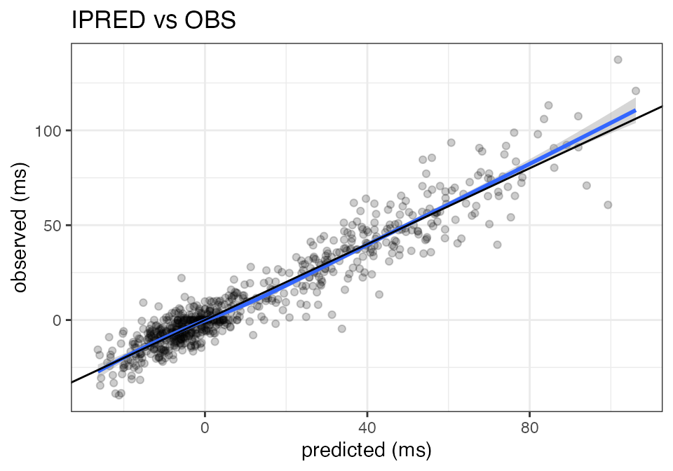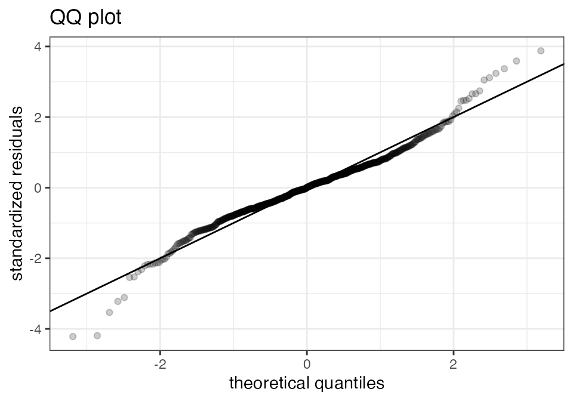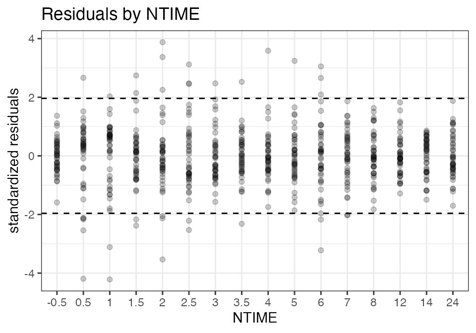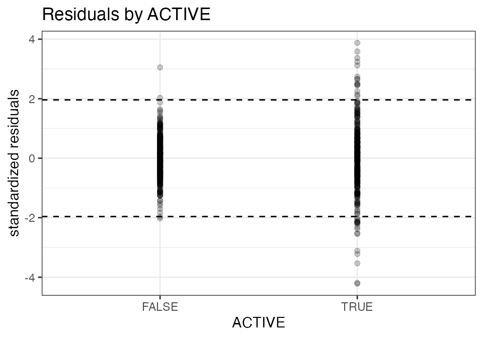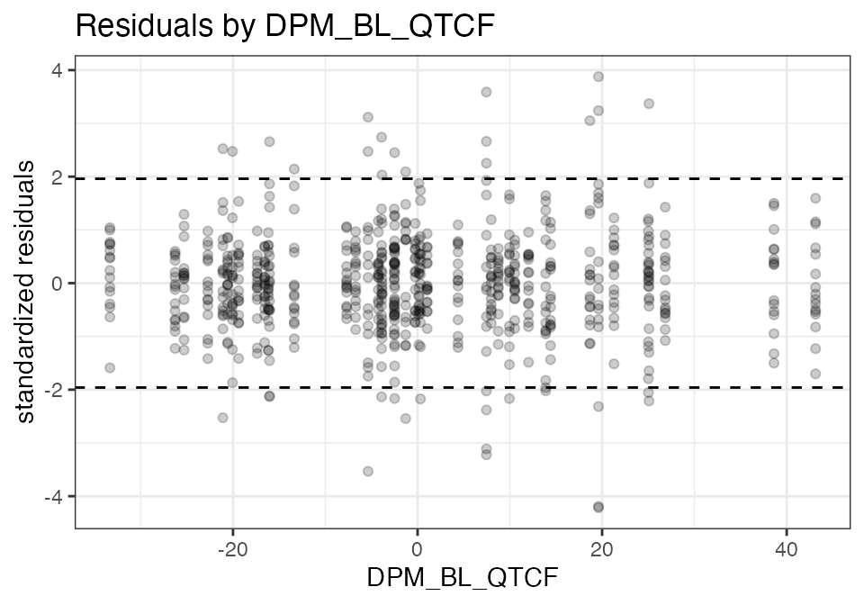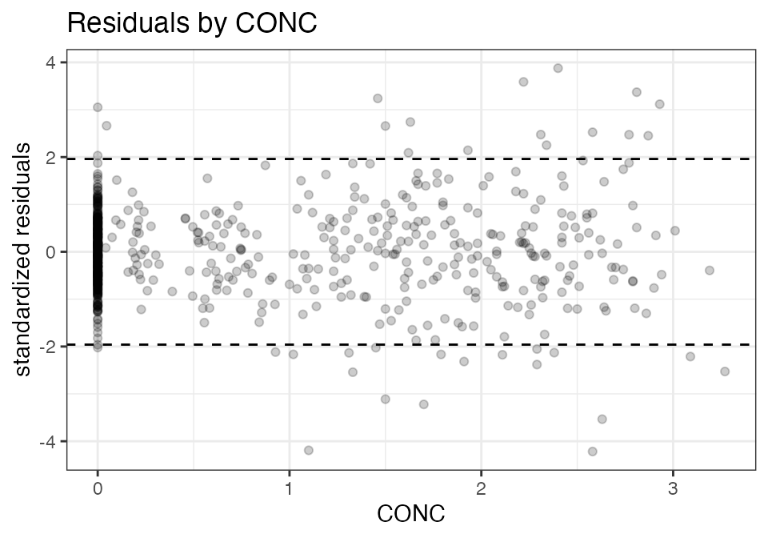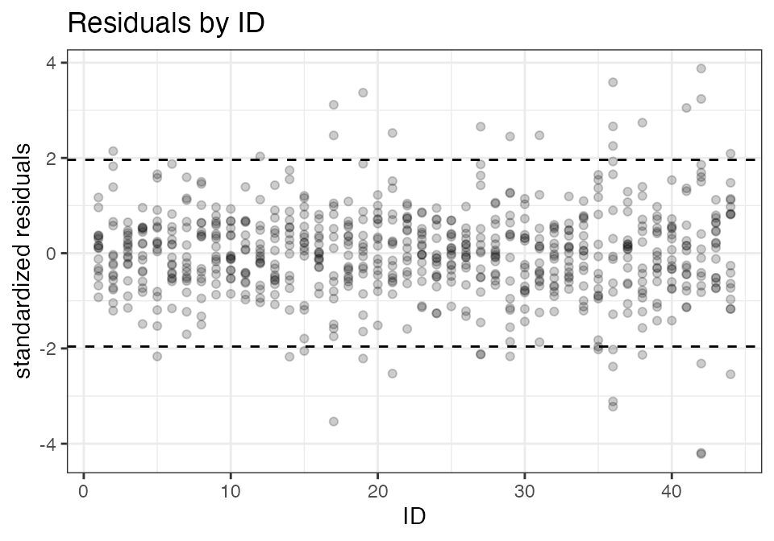
