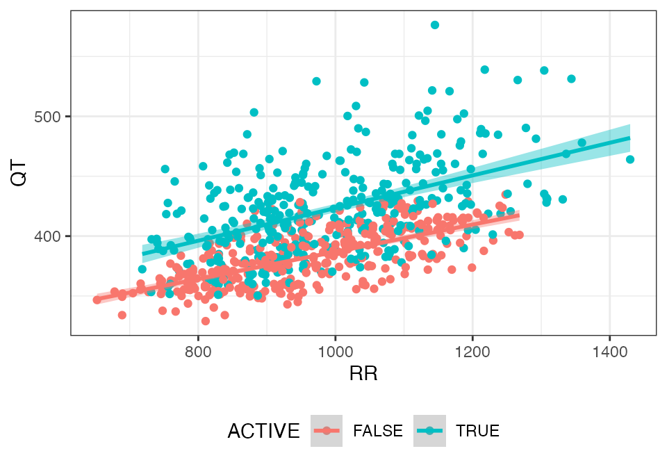
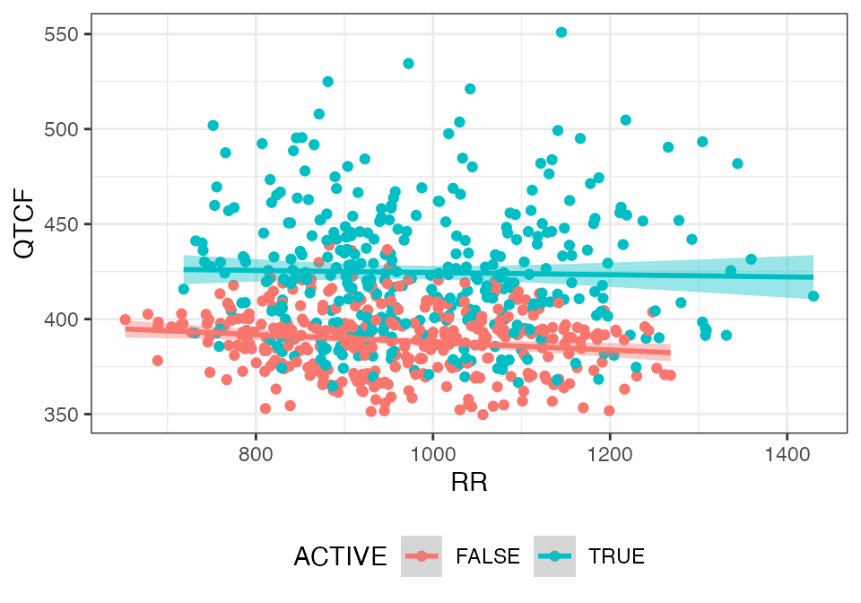
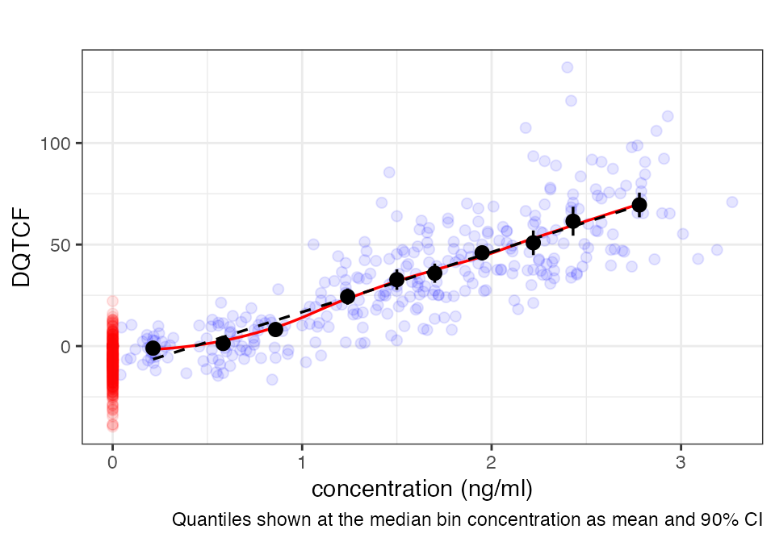

# Concentration-QTc modeling example

``` r
library(dplyr)
library(ggplot2)
library(knitr)
library(lme4)
library(lmerTest)
library(lsmeans)
library(cqtc)
```

This example is based on Parkinson, J., Dota, C. & Rekić, D. Practical
guide to concentration-QTc modeling: a hands-on tutorial. J
Pharmacokinet Pharmacodyn 52, 43 (2025).
<https://doi.org/10.1007/s10928-025-09981-8>

The dofetilide and verapamil data sets used in the publication are
provided as sample data files in this package. This example makes use of
the dofetilide data:

``` r
head(dofetilide_cqtc, 5)
#>   ID ACTIVE NTIME CONC       QT     QTCF      DQTCF       RR HR
#> 1  1  FALSE  -0.5    0 371.0000 391.5099  0.0000000 851.0000 71
#> 2  1  FALSE   0.5    0 381.3333 385.5113 -5.9985922 968.0000 62
#> 3  1  FALSE   1.0    0 368.6667 391.3640 -0.1459669 836.0000 72
#> 4  1  FALSE   1.5    0 368.0000 389.4623 -2.0476373 844.0000 71
#> 5  1  FALSE   2.0    0 377.3333 394.0007  2.4907356 878.6667 68
```

## DATA PREPROCESSING

The data set is extended with the following:

- add individual baseline QTcF (BL_QTCF):

``` math
DQTCF = \Delta QTcF_{i,t} = QTcF_{i,t} - QTcF_{i,predose}
```

- calculate the population mean for the baseline QTcF by treatment group
  (PM_BL_QTCF):

``` math
PM\_BL\_QTF = \overline {QTc_0}
```

- calculate the difference between the individual baseline QTcF and the
  respective population mean baseline QTcF:

``` math
DPM\_BL\_QTCF = QTc_{i,j=0} - \overline {QTc_0}
```

- calculate the difference between DQTCF and the group mean DQTCF of the
  control population by time point (DDQTCF):

``` math
DDQTCF = \Delta \Delta QTcF_{i,t} = \Delta QTcF_{i,t} - \overline{\Delta QTcF_{control,t}}
```

- change the numeric nominal time field (NTIME) to factors

``` r
dof <- dofetilide_cqtc %>%
  cqtc_add_baseline("QTCF", baseline_filter = "NTIME == -0.5") %>% 
  add_bl_popmean("BL_QTCF") %>%
  mutate(DPM_BL_QTCF = BL_QTCF - PM_BL_QTCF) %>%
  derive_group_delta("DQTCF") %>% 
  mutate(NTIME = as.factor(NTIME))
```

## EXPLORATORY DATA ANALYSIS

### Drug effect on heart rate

``` r
rr_plot(dof, "QT", group = "ACTIVE")
```



``` r
rr_plot(dof, "QTCF", group = "ACTIVE")
```



### Assessment of hysteresis

``` r
cqtc_time_course_plot(dof, "QTCF")
```


``` r
cqtc_hysteresis_plot(dof, "DDQTCF")
```


### Linear concentration-QTc relationship

``` r
cqtc_ntile_plot(dof, lm = TRUE, loess = TRUE)
```



## LINEAR MIXED EFFECTS MODELING

### Modeling

``` r
mod <- lmerTest::lmer(
  DQTCF ~ NTIME + ACTIVE + DPM_BL_QTCF + CONC + (CONC||ID),
  data = dof)

# parameter estimates
temp <- as.data.frame(coef(summary(mod, ddf="Kenward-Roger")))
colnames(temp) <- c("estimate", "se", "df", "t", "p")
parameters <- temp %>%
  mutate(
    rse = se/estimate * 100,
      lci = estimate + qt(0.025, df = df) * se,
      uci = estimate + qt(0.975, df = df) * se,
      p = ifelse(p < 0.001, "< 0.001", signif(p, 3))) %>%
  select(estimate, lci, uci, rse, p)

parameters %>% 
  kable(caption = "Model parameters")
```

|             |    estimate |         lci |        uci |         rse | p        |
|:------------|------------:|------------:|-----------:|------------:|:---------|
| (Intercept) |   0.4306187 |  -3.2962263 |  4.1574636 |  438.395282 | 0.82     |
| NTIME0.5    | -13.8730718 | -17.7969140 | -9.9492296 |  -14.402955 | \< 0.001 |
| NTIME1      | -13.4245003 | -17.4376061 | -9.4113944 |  -15.222989 | \< 0.001 |
| NTIME1.5    |  -7.5243725 | -11.6192256 | -3.4295194 |  -27.712912 | \< 0.001 |
| NTIME2      |  -3.0368229 |  -7.2969280 |  1.2232821 |  -71.435238 | 0.162    |
| NTIME2.5    |   0.4712304 |  -3.8611367 |  4.8035975 |  468.170053 | 0.831    |
| NTIME3      |  -3.1581633 |  -7.4340772 |  1.1177505 |  -68.945493 | 0.147    |
| NTIME3.5    |  -7.8920967 | -12.0581411 | -3.7260523 |  -26.880806 | \< 0.001 |
| NTIME4      |  -6.8556219 | -11.0126077 | -2.6986361 |  -30.877506 | 0.00126  |
| NTIME5      |  -7.5582831 | -11.6098136 | -3.5067526 |  -27.296448 | \< 0.001 |
| NTIME6      |  -8.1181883 | -12.1499920 | -4.0863847 |  -25.290082 | \< 0.001 |
| NTIME7      |  -8.6626845 | -12.6402115 | -4.6851575 |  -23.381391 | \< 0.001 |
| NTIME8      |  -9.5300836 | -13.4748652 | -5.5853021 |  -21.078317 | \< 0.001 |
| NTIME12     | -13.2972069 | -17.1698703 | -9.4245435 |  -14.830593 | \< 0.001 |
| NTIME14     | -13.0735203 | -16.9367363 | -9.2103043 |  -15.047550 | \< 0.001 |
| NTIME24     |  -5.7817519 |  -9.6183265 | -1.9451774 |  -33.790366 | 0.0032   |
| ACTIVETRUE  |  -0.8612373 |  -4.9587716 |  3.2362969 | -238.091700 | 0.676    |
| DPM_BL_QTCF |  -0.1707644 |  -0.2765497 | -0.0649791 |  -30.604407 | 0.0023   |
| CONC        |  26.7150455 |  23.4834793 | 29.9466116 |    5.916917 | \< 0.001 |

Model parameters

``` r

grid <- ref.grid(
  mod,
  at = list(
    CONC = seq(0, max(dof$CONC, na.rm = TRUE)),
    ACTIVE = c(FALSE, TRUE),
    DPM_BL_QTCF = 0))

temp1 <- summary(lsmeans::lsmeans(
  grid,
  c("CONC", "ACTIVE"),
  level = 0.9)) %>%
  filter(ACTIVE == TRUE)

dof %>%
  cqtc_ntile_plot(param = "DQTCF", n = 10) +
  geom_line(data = temp1, aes(x = CONC, y = lsmean)) +
  geom_ribbon(
    data = temp1,
    aes(x = CONC, ymin = lower.CL, ymax = upper.CL, y = lsmean),
    alpha = 0.2)
```


### Model diagnostics

``` r
invisible(capture.output(
  cqtc_gof_plot(mod)
))
```


