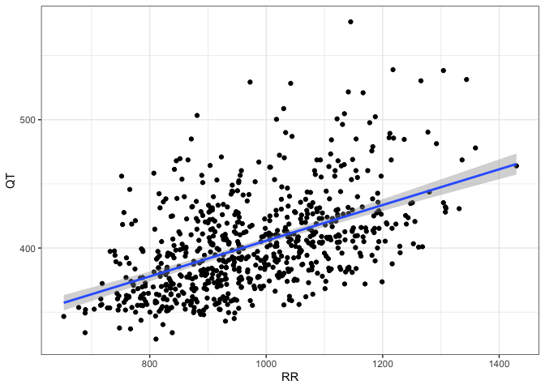
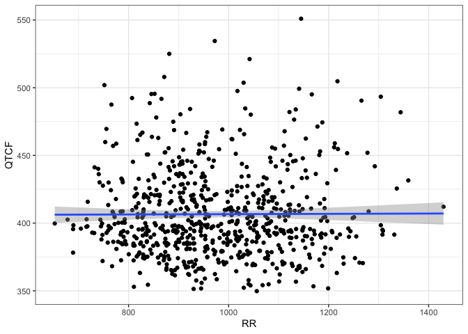
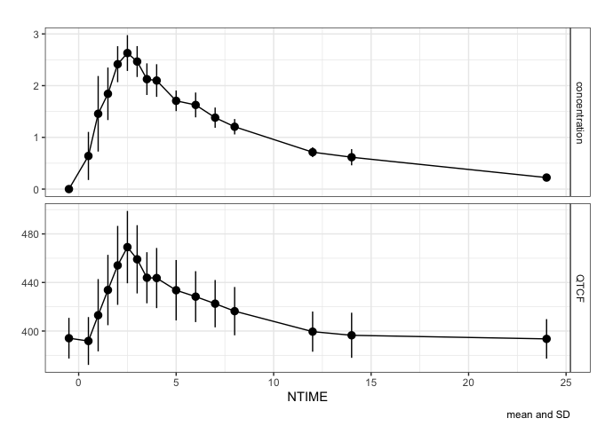
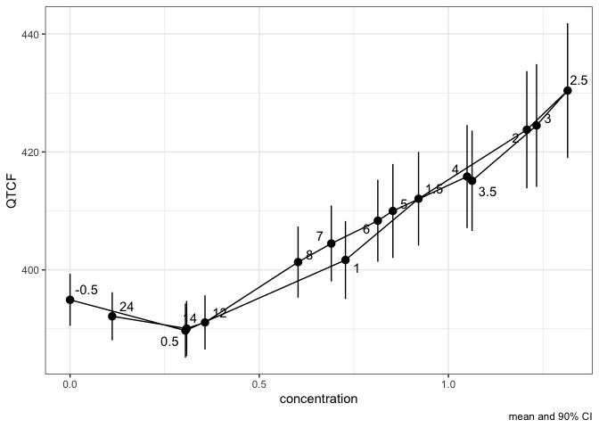
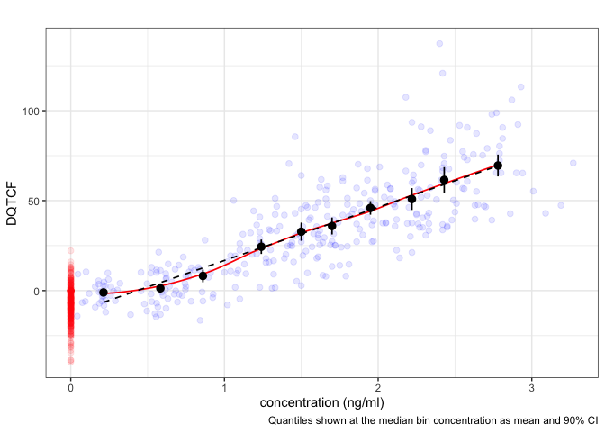

# cqtc

This package provides functions to facilitate and streamline
concentration-QTc analysis of clinical ECG data.

## Installation

You can install the development version of cqtc like so:

``` r
devtools::install_github("rstrotmann/cqtc")
```

## Example

The basic building block for further analyses is the cqtc data object.
This package includes sample data for dofetilide and verapamil copied
from *Parkinson, J., Dota, C. & Rekić, D. Practical guide to
concentration-QTc modeling: a hands-on tutorial. J Pharmacokinet
Pharmacodyn 52, 43 (2025)* <https://doi.org/10.1007/s10928-025-09981-8>.

The following is a basic example which demonstrates how to create an
exploratory c-QTc plot for the dofetilide data set. For further
analysis, including linear mixed effects modeling, see
[`vignette("cqtc")`](articles/cqtc.md).

``` r
library(cqtc)
library(nif)
#> 
#> Attaching package: 'nif'
#> The following objects are masked from 'package:cqtc':
#> 
#>     add_ntile, subjects
library(dplyr)
#> 
#> Attaching package: 'dplyr'
#> The following objects are masked from 'package:stats':
#> 
#>     filter, lag
#> The following objects are masked from 'package:base':
#> 
#>     intersect, setdiff, setequal, union

dof <- dofetilide_cqtc %>%
  cqtc_add_baseline("QTCF", baseline_filter = "NTIME == -0.5") %>% 
  add_bl_popmean("BL_QTCF") %>%
  mutate(DPM_BL_QTCF = BL_QTCF - PM_BL_QTCF) %>%
  derive_group_delta("DQTCF") %>% 
  mutate(NTIME = as.factor(NTIME))


dof <- cqtc(
  dofetilide,
  conc_field = "Cplasma",
  baseline_filter = "NTIME == -0.5")
#> ℹ HR was derived from RR!
```

## Hear rate correction

``` r
rr_plot(dof, "QT")
```



``` r
rr_plot(dof, "QTCF")
```



## Assessment of hysteresis

``` r
cqtc_time_course_plot(dof, "QTCF")
```



``` r
cqtc_hysteresis_plot(dof)
```



## Exploratory c-QTc plot

``` r
cqtc_ntile_plot(dof, lm = TRUE, loess = TRUE)
```


